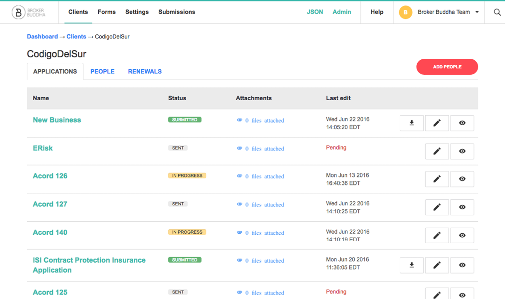
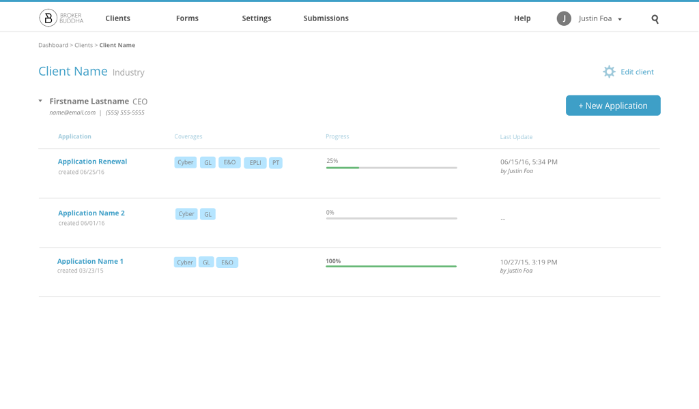
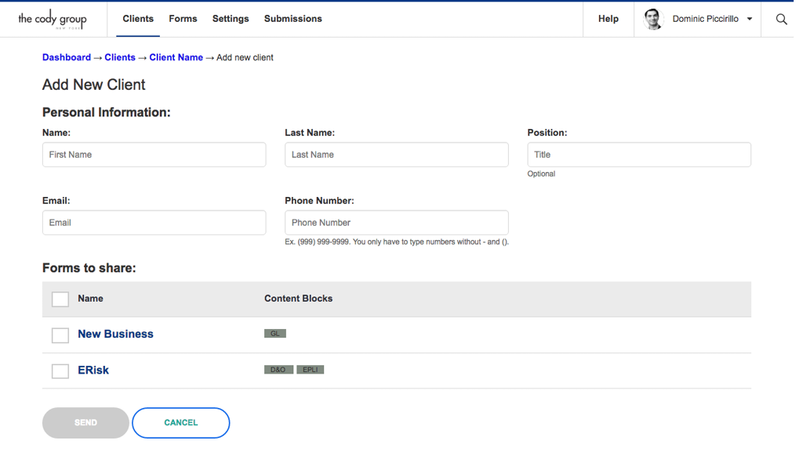
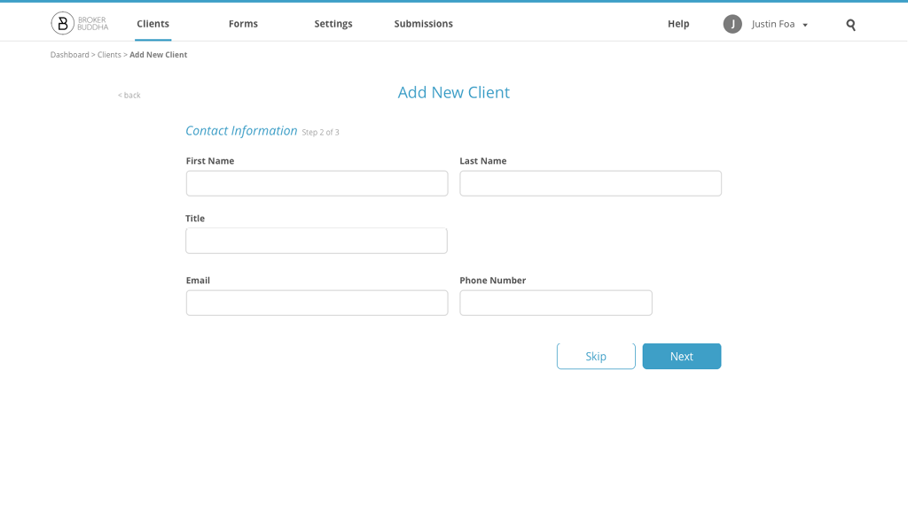
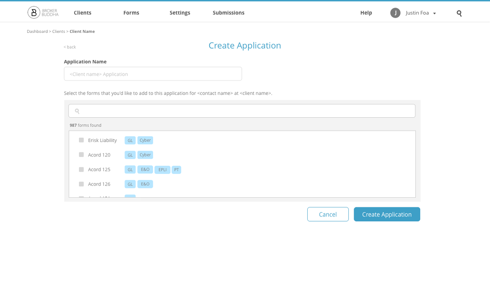
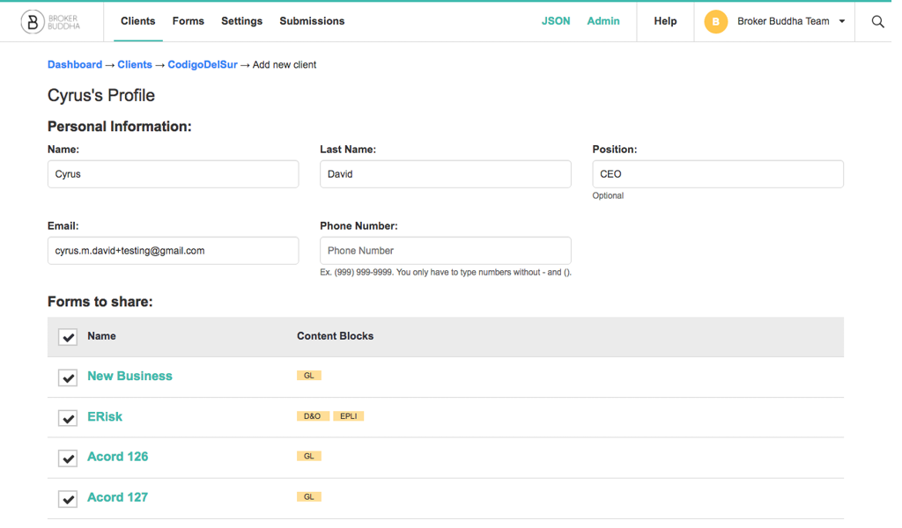
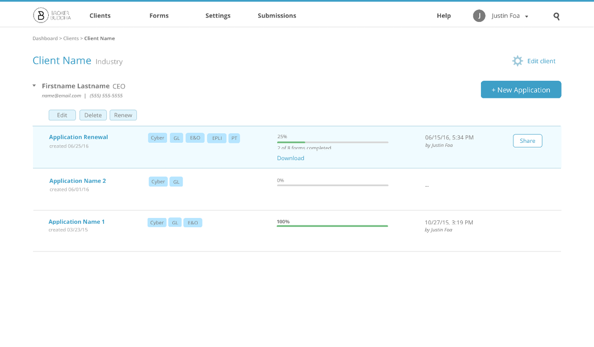
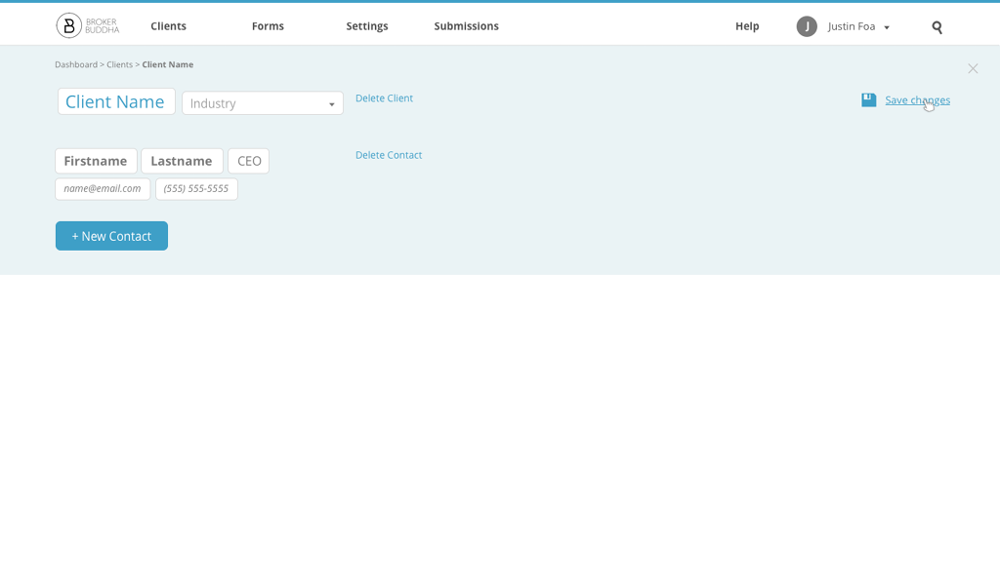
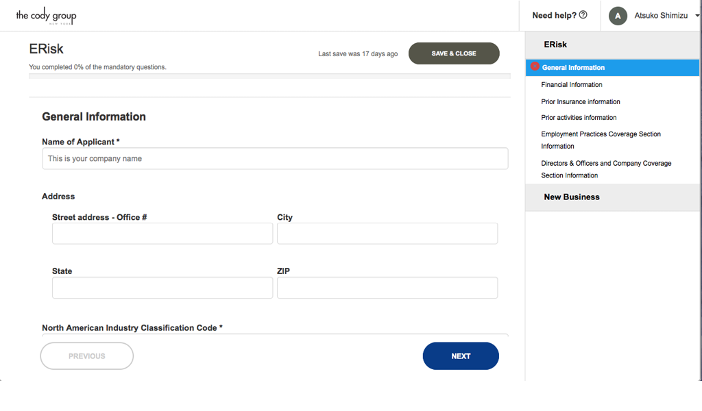
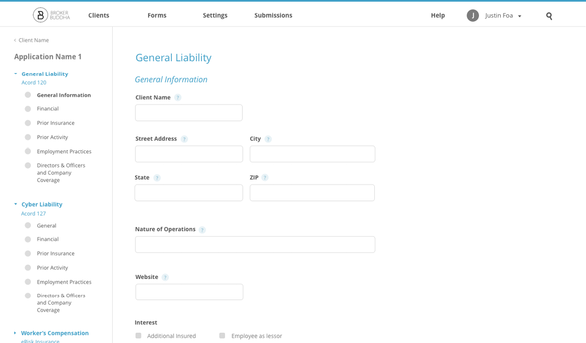

  Landing Page
  
My first assignment was to create the landing page in HTML/CSS. The layout was extremely simple, which was perfect for practicing how to code a responsive layout. I chose <a href="http://getskeleton.com/">Skeleton.css </a> because of the simplicity and lightness of the page.
  

  

    I was also assigned to create a function that would save the email to a Google spreadsheet. To achieve this, I used a Javascript function and AJAX using the unique URL of Google Spreadsheets and AJAX 'POST' function. I faded the button and text field when the function was in progress as a user experience detail.
  

  
    $("#form").fadeTo(500, 0.5);
    e.preventDefault();

    $.ajax({
            url:"", // unique URL
            data:{"" : email}, // {entry_num : email}
            type:"POST",
            dataType:"xml",
            success: function () {
                setTimeout(function(){ $("#form").remove(); $("#error").remove(); }, 1300);
                setTimeout(function(){ $("#message").html("Thank you, we'll be in touch soon."); }, 1300);
            }
  

  
You can see the finished landing page <a href="https://www.brokerbuddha.com/landing/index">here!</a>

  Product
  
When I first arrived, the Broker Buddha product had basic functions and layout put in place. I had to ask <i>numerous</i> questions throughout the internship, as I was unfamiliar with the insurance world. I wanted to understand how the information and tools on the product can be organized so that a broker and client would have some intuition using the product.
  

  
  
My first task was to think of a better solution to organize 'Clients', 'Applications', 'Forms', 'People', and 'Renewals'. (I've learned that in the insurance world, a client is typically a company or organization). This was a long, iterative process, involving numerous discussions and drafts. In the end, we created this organization system:  
  - Clients had contacts associated with them (we replaced 'People' with 'Contacts' as it was more appropriate)  
  - Each contact had applications  
  - Applications contained individual insurance forms. Bundling forms into applications made the renewal process easier, as clients can simply renew an application versus renewing individual forms.
  

  

  

    I also had the freedom to experiment with the visual design on the product. I changed the font from Flama to Open Sans. I felt that Open Sans was a cleaner sans-serif font and was easily accessible using Google Fonts API.  
    The client has the option to customize the colors of the product to match their own brand. I chose blue as the accent color in the UI designs as it felt most neutral. I got rid of the numerous accent colors in the old product to increase the contrast between accent color and neutral colors used for copy.
  

  
 Below was the old screen of adding new clients and forms.
  

  
  
We changed the entire experience. Each step would take up the entire screen, and going to the next step was a simple slide transition (no refresh required). Clients now have the option to skip steps and come back to it later.

  
  

  
With the new organization system of forms and applications, we moved editing functions for individual classes of information to more accessible places.

  
  
To decrease visual clutter, we hid the Edit, Delete, and Renew buttons until a client selected an application.

  
  
Editing a client was as simple as clicking Edit Client on the new client page.

  

  
Insurance form-filling was the basis of the product. This was the form-filling experience of the old product:

  
  

  I brainstormed a few solutions to reorganize the content of form-filling. I moved the form sections to the left, as I felt that was more conventional and familiar, and redesigned a few UI elements. In insurance, it made more sense to organize forms by their coverage (especially in the client's perspective), with the form name secondary.

  

  Conclusions
  
Designing was an extremely iterative process, which I do not illustrate here. There were many UI/UX problems that I didn't mention above. This was my first major user interface design experience and it was incredibly valuable to me. I've learn a <i>ton</i> and was extremely lucky that my boss took a huge risk to hire me as their design intern that summer. I loved the UI/UX problems we discussed and solved (and discovered more UI/UX issues in the process). This experience truly solidified my desire to work in product design in the future.

  
I also fell in love with Manhattan this summer... amazing place!

