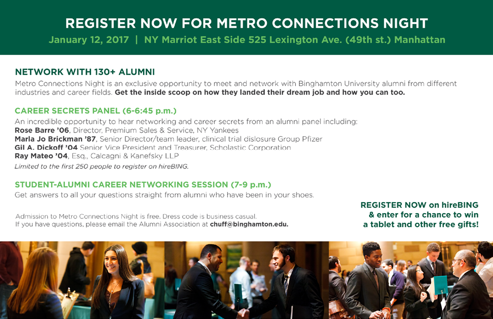
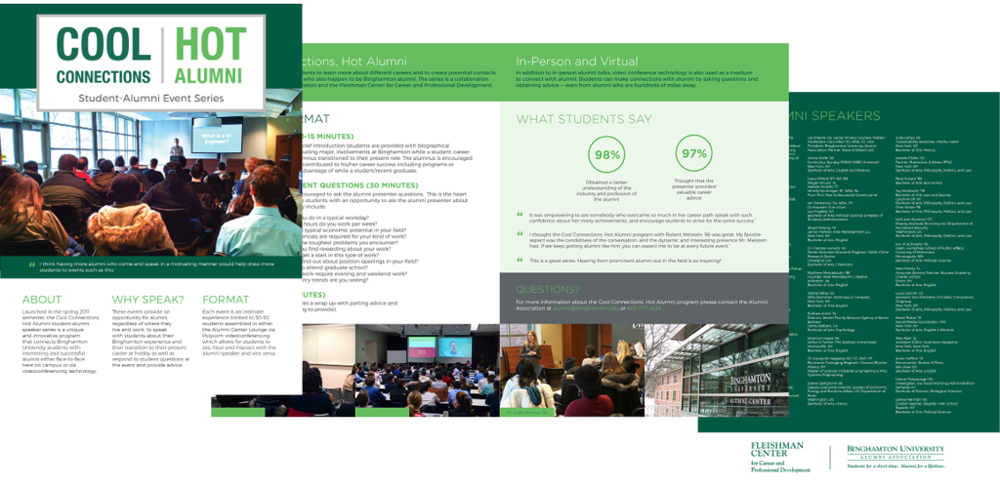
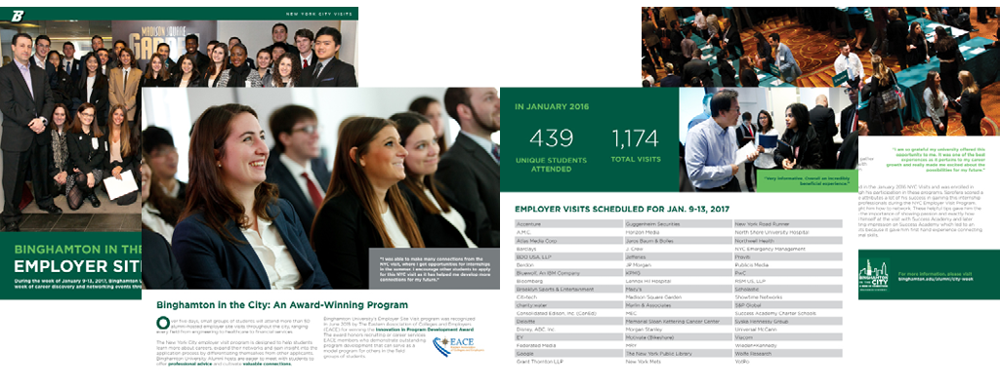
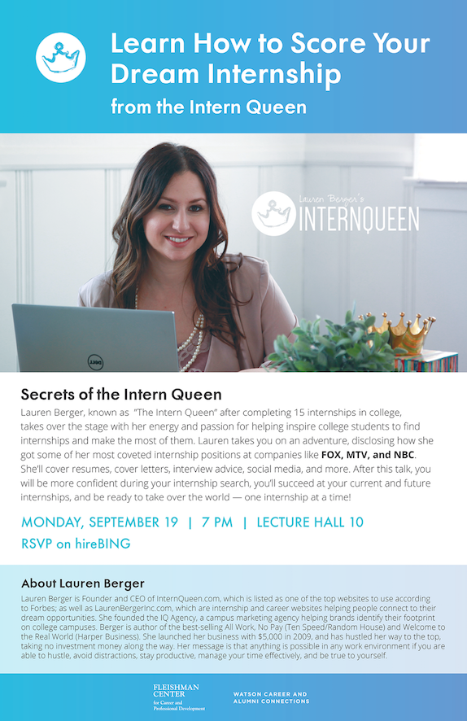

  Working with the Binghamton Brand
  
 For me, working with an established brand allows me to focus on the design problems associated with the content itself: organization and prioritization. 

  
Typically for every assignment, I am given the text content of the flyer, brochure, poster, etc. to be made. Other than the Cool/Hot Alumni Speaker Series (which already has a design template), I first play around with the layout of the content, and decide which information is the most important, can be taken out, and best fit together.  A few things I ask myself: "what items can be turned into a list for easy, concise reading?", "What photographs best represent the content?","Where/how can I break up the content into sections?"

  
I typically like to use white on Binghamton's pantone green for headings, and the lighter green on pantone for subheadings.

  
A half-sheet about Metro Connections Night.

  
   
   
  
The following two brochures were the lengthier projects I got to work on. I designed a brochure about our alumni speaker series called Cool Hot Alumni, and designed another for our Employer Visits program.

  
  

  
Occasionally, the Fleishman Center invites outside speakers to come to the university. For these designs, I do initial research to see if their company already have a brand design. I try my best to use their branding elements, such as font, color, and logos, in the promotional materials. This is my favorite example:

  

  
To see more of my Fleishman Center work, please visit my <a href="https://www.behance.net/gallery/35907999/Fleishman-Center-at-BU">Behance.</a>

