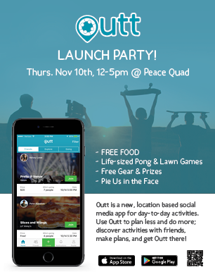
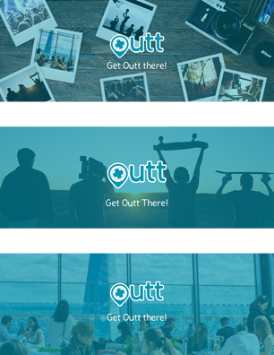
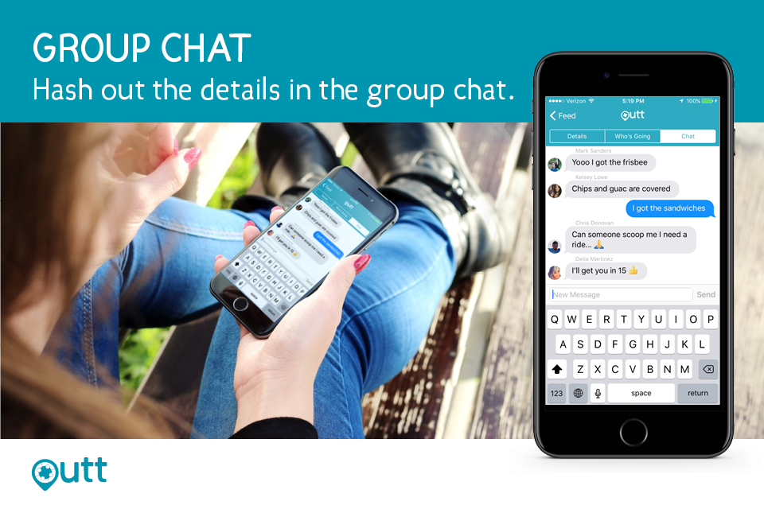

  Marketing
  
I started working with Outt late in the semester (around the end of October 2016). My initial tasks were marketing-related. I designed flyers for our launch event and social media graphics.

  

    
  

  

    
  

  

    
  

  

    
  

  

    
  

  User Interface Design
  
I'm currently working on the UI of the mobile app. I can't share anything in particular at the moment, but I'm currently documenting my progress. I hope to update this page at the end of the semester!

